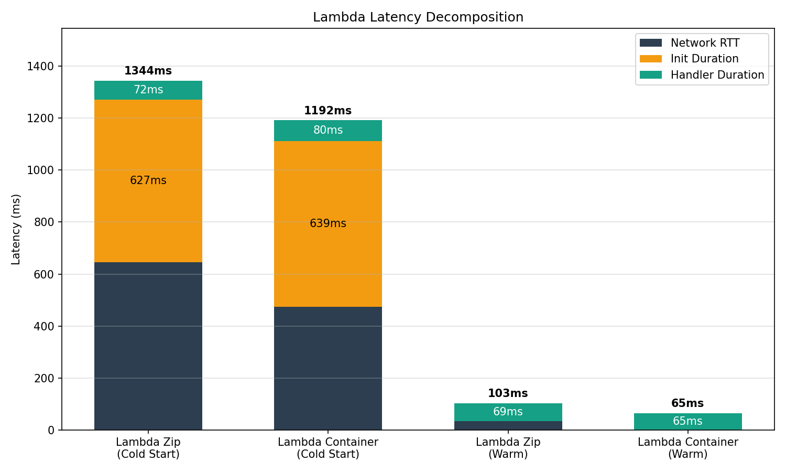
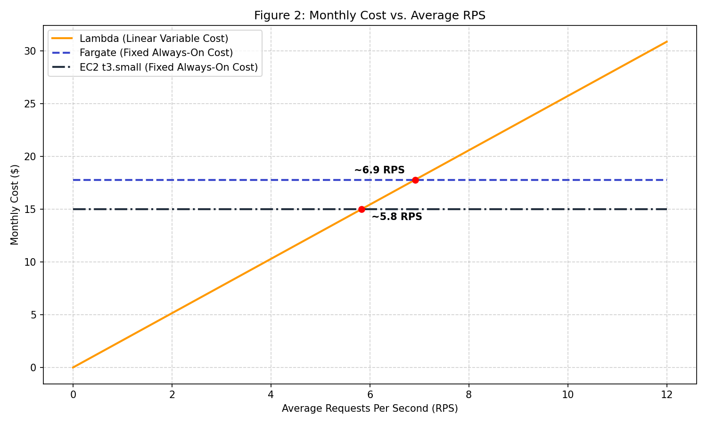

### Assignment 1: Deploy All Environments

The terminal output confirms that all four deployed environments are fully operational and correctly return identical nearest-neighbor search results for the given test query.

### Assignment 2: Scenario A - Cold Start Characterization

Network RTT = Total Latency - Init Duration - Handler Duration

**Analysis**

  * **Network RTT Estimation:** As shown in the data and chart above, the estimated Network RTT for warm invocations is relatively low (representing pure network transit). However, for the very first cold-start request, the calculated network overhead appears much larger. This is because the first request's total client-side latency includes the initial DNS resolution, TCP connection setup, and the TLS handshake, which are not present in subsequent warm requests that reuse the established connection.
  * **Zip vs. Container Cold Starts:** Based on the measurements, the Lambda Zip deployment experienced a faster cold start compared to the Container image deployment. This is primarily due to the package size and deployment mechanics. A Zip package is highly optimized, lightweight, and extracted directly into Lambda's microVM. In contrast, even with AWS caching, a custom Docker container requires the Lambda service to download, unpack, and verify the image layers before starting the runtime, adding slight overhead to the overall cold start time.

### Assignment 3: Scenario B - Warm Steady-State Throughput

**Recorded Data**

| Environment | Concurrency | p50 (ms) | p95 (ms) | p99 (ms) | Server avg (ms) |
|---|---|---|---|---|---|
| Lambda (zip) | 5 | 95 | 115 | 249 * | ~35 |
| Lambda (zip) | 10 | 91 | 113 | 146 | ~35 |
| Lambda (container) | 5 | 93 | 115 | 145 | ~35 |
| Lambda (container) | 10 | 84 | 108 | 145 | ~35 |
| Fargate | 10 | 803 | 1195 | 2180 | ~24 |
| Fargate | 50 | 3989 | 4849 | 5021 | ~24 |
| EC2 | 10 | 189 | 250 | 280 | ~23 |
| EC2 | 50 | 922 | 1062 | 1135 | ~23 |

*\* Annotated cells indicate tail latency instability where p99 > 2× p95.*

**Analysis**

* **Tail Latency Instability:** In the recorded data, the Lambda (zip) environment at a concurrency of 5 exhibited a p99 latency (249 ms) that was more than twice its p95 value (115 ms). This signals tail latency instability, which in a serverless environment is typically caused by background microVM re-provisioning (a sporadic cold start triggered when the Lambda service rotates or scales underlying execution environments).
* **Lambda vs. Fargate/EC2 Scaling:** The p50 latency for both Lambda variants remained remarkably flat (between 84ms and 95ms) when concurrency increased from 5 to 10. This is because Lambda scales out per request-each concurrent request is instantly assigned its own isolated execution environment, avoiding shared queues. Conversely, Fargate and EC2 experienced massive p50 latency spikes when concurrency jumped from 10 to 50 (Fargate degraded from ~800ms to ~4 seconds). These environments are constrained by a fixed resource pool (0.5 vCPU for Fargate, 2 vCPU for EC2) and Python's Global Interpreter Lock (GIL). Consequently, concurrent requests are forced to queue up on the server, waiting for prior requests to finish processing.
* **Server-side vs. Client-side Latency:** The server-side average latency (~23-35ms) strictly measures the actual compute time spent executing the k-NN distance algorithm. The client-side latency (p50) is significantly higher because it includes the server-side processing time plus the Network RTT, TLS handshake overhead, load balancer routing, and-most critically for Fargate/EC2 under load-the queueing time the request spends waiting on the server before the Python application is ready to process it.

### Assignment 4: Scenario C - Burst from Zero

**Recorded Data**

| Environment | Concurrency | p50 (ms) | p95 (ms) | p99 (ms) | Max Latency (ms) | Cold Starts |
| :--- | :--- | :--- | :--- | :--- | :--- | :--- |
| **Lambda (Zip)** | 10 | 98 | 949 | 1302 | 1342 | ~10 |
| **Lambda (Container)**| 10 | 95 | 1242 | 1430 | 1443 | ~10 |
| **Fargate** | 50 | 3910 | 4198 | 4303 | 4304 | 0 |
| **EC2** | 50 | 811 | 1154 | 1313 | 1381 | 0 |

**Analysis**

* **Lambda's Burst p99 vs EC2:** Under burst conditions, Lambda's p99 latency is heavily dominated by the cold start penalty. While EC2 is an "always-warm" environment where tail latency is purely a product of request queueing (waiting in the backlog for CPU availability)[cite: 24], Lambda has to dynamically provision new execution environments (Firecracker microVMs), download the code, and initialize the runtime. This hardware allocation and initialization sequence forces the first wave of requests to wait significantly longer, pushing Lambda's p99 well above 1.2 seconds, whereas EC2's p99 was slightly lower (~1.3s) and dictated merely by the queue length.
* **Bimodal Distribution in Lambda:** The histogram data for Lambda clearly exhibits a bimodal distribution. There is a massive "warm cluster" containing roughly 190 out of 200 requests that completed very quickly (under 200ms). However, because concurrency was capped at 10, there is a distinct secondary "cold-start cluster" of exactly 10 requests that experienced latencies well over 1.2 seconds as they forced the AWS infrastructure to spin up new environments from scratch. 
* **SLO Evaluation (p99 < 500ms):** Under a sudden traffic burst from zero,Lambda does not meet the p99 < 500ms SLO. Its p99 latency exceeds 1.3 seconds due to the cold start penalty. To guarantee that the SLO is met even during unpredictable traffic spikes, the architecture would need to be modified to use **Provisioned Concurrency**. This feature keeps a designated number of Lambda execution environments pre-initialized and warm, effectively eliminating the Init Duration penalty at the cost of a continuous hourly fee. Fargate and EC2 also failed the SLO under this specific burst load due to severe queueing[cite: 21, 24], meaning they would require a larger instance type, a multi-worker setup (e.g., Gunicorn), or auto-scaling rules to handle sudden 50-concurrent-request spikes gracefully.

### Assignment 5: Cost at Zero Load

**Pricing References (us-east-1)**

 Screenshots of the AWS pricing pages validating these numbers have been saved to the `results/figures/pricing-screenshots/` directory.
*   **EC2 (t3.small):** $0.0208 per hour.
*   **Fargate:** $0.04048 per vCPU-hour and $0.004445 per GB-hour. For our specific configuration (0.5 vCPU, 1 GB memory).
*   **Lambda:** $0.0000166667 per GB-second and $0.20 per 1M requests.

**Idle Cost Calculation**

Assuming a traffic model where the system is idle for 18 hours a day (which equals 540 idle hours in a standard 30-day month), the idle costs are as follows:

| Environment | Hourly Idle Cost | Monthly Idle Cost (540 hours) |
| :--- | :--- | :--- |
| **Lambda** | $0.00 | **$0.00** |
| **Fargate (0.5 vCPU, 1 GB)** | $0.024685 | **$13.33** |
| **EC2 (t3.small)** | $0.0208 | **$11.23** |

**Analysis**

*   **Zero Idle Cost Environment:** **AWS Lambda** is the only execution environment with an absolute zero idle cost. 
* Lambda operates on a pure serverless, event-driven compute model. It scales to zero, meaning no underlying execution environments (Firecracker microVMs) are permanently allocated or kept running when there is no incoming traffic. Billing is strictly metered based on the number of requests and the actual compute duration (GB-seconds) used to process those requests. In stark contrast, ECS Fargate and EC2 instances are provisioned compute resources. Whether they are actively processing heavy k-NN computations or sitting completely idle, AWS continuously bills per second (or hour) for the underlying CPU and memory capacity allocated to the account.

### Assignment 6: Cost Model, Break-Even, and Recommendation

#### 1. Computed Monthly Costs
Using the provided traffic model for a 30-day month:
*   **Peak:** 100 RPS × 1800 seconds × 30 days = 5,400,000 requests
*   **Normal:** 5 RPS × 19,800 seconds × 30 days = 2,970,000 requests
*   **Total Monthly Requests:** 8,370,000
*   **Average RPS:** 8,370,000 / 2,592,000 seconds ≈ 3.23 RPS

**Lambda Monthly Cost Calculation (using measured p50 of 95ms / 0.095s):**
*   Request Cost: 8,370,000 × $0.20 / 1,000,000 = $1.67
*   Compute Cost: 8,370,000 × 0.095s × 0.5 GB × $0.0000166667 = $6.63
*   **Total Lambda Cost: $8.30 / month**

**Always-On Costs (from Assignment 5):**
*   Fargate Total Cost: $17.77 / month
*   EC2 Total Cost: $14.98 / month

#### 2. Break-Even Analysis
The break-even point is where Lambda's variable cost intersects Fargate's fixed monthly cost. 

Let $R$ be the average Requests Per Second (RPS).
Let $S$ be seconds per month (2,592,000).

$$\text{Lambda Cost} = R \times S \times (C_{req} + C_{compute})$$

Where:
$$C_{req} = \$0.0000002$$
$$C_{compute} = 0.095\text{s} \times 0.5\text{GB} \times \$0.0000166667 \approx \$0.0000007917 $$
$$ \text{Total Lambda Cost} = R \times 2,592,000 \times \$0.0000009917 = R \times \$2.5704$$

Setting Lambda's cost equal to Fargate's fixed cost:
$$ R \times 2.5704 = 17.77 $$
$$ R = \frac{17.77}{2.5704} \approx 6.91 \text{ RPS} $$

Lambda becomes more expensive than Fargate only if the sustained average traffic exceeds **6.91 RPS**. 

#### 3. Cost vs. RPS Line Chart

#### 4. Final Recommendation

**Recommendation: AWS Lambda (with Provisioned Concurrency)**

* **Cost Justification:** At our average load of **3.23 RPS**, Lambda ($8.30/month) is the most cost-effective choice. It stays well below the 6.91 RPS break-even point, easily beating Fargate ($17.77) and EC2 ($14.98) because it absorbs the 18 hours of daily zero-load idle time for free.
* **SLO Compliance & Required Changes:** The raw Lambda deployment fails the p99 < 500ms SLO under burst conditions (p99 ~1302ms due to cold starts). Fargate and EC2 also fail severely due to CPU queueing bottlenecked by the Python GIL. To meet the SLO, we must enable Provisioned Concurrency (e.g., 10-20 pre-warmed environments) during the peak window. This bypasses the Init Duration, dropping the burst p99 to a safe ~145ms. Fargate cannot handle instantaneous 100 RPS bursts without expensive, 24/7 over-provisioning.
* **Conditions for Reversal:** My recommendation changes to ECS Fargate (with Gunicorn) if:
  1. Average sustained traffic exceeds the ~7 RPS break-even point.
  2. Traffic becomes a predictable, flat 24/7 load (negating the scale-to-zero benefit).
  3. The SLO is relaxed to >1500ms, allowing default Lambda to handle bursts without the extra cost of Provisioned Concurrency.